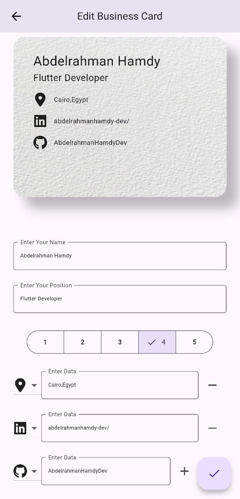

# Convo

## Overview

Convo is a Flutter application that allows users to create, modify, and share their business cards offline using QR codes.

The app enables seamless sharing of business details without the need for an internet connection.

## Architecture

Convo follows the **`MVC (Model-View-Controller)`** architectural pattern:

**Model**: Defines the BusinessCard model that holds user details.

**View**: Includes screens for Home, Modify, Share, and Scan, along with reusable widgets.

**Controller**: Manages data persistence with SharedPreferences.

## Features

- **Home Screen:** Displays the business card with an entry animation effect.
- **Modify Screen:** Allows users to update their business card details with a live preview.
- **Share Screen:** Generates a QR code containing the business card information in JSON format, with a fade animation effect.
- **Scan Screen:** Scans business card QR codes to retrieve and display shared details.
- **Offline Storage:** Saves the user's business card details using SharedPreferences.
- **Responsive UI:** Adapts to different screen sizes for an optimal user experience.

## 🛠️ Installation

1. **Clone the Repository:**
   ```sh
   git clone https://github.com/yourusername/convo.git
   cd convo
   ```
2. **Install Dependencies:**
   ```sh
   flutter pub get
   ```
3. **Run the App:**
   ```sh
   flutter run
   ```

## 📦 Dependencies

Ensure you have the following dependencies in your `pubspec.yaml` file:

```yaml
auto_size_text_field: ^2.2.4
font_awesome_flutter: ^10.8.0
shared_preferences: ^2.5.3
qr_flutter: ^4.1.0
qr_code_scanner_plus: ^2.0.10+1
permission_handler: ^11.4.0
flutter_screenutil: ^5.9.3
```

## Screenshots

| Home Screen                   | Modify Screen                  | Share Screen                 |     |
| ----------------------------- | ------------------------------ | ---------------------------- | --- |
|  |  |  |
